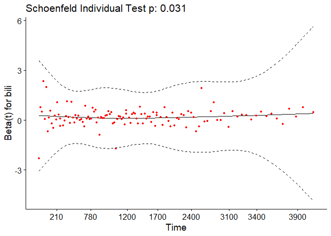
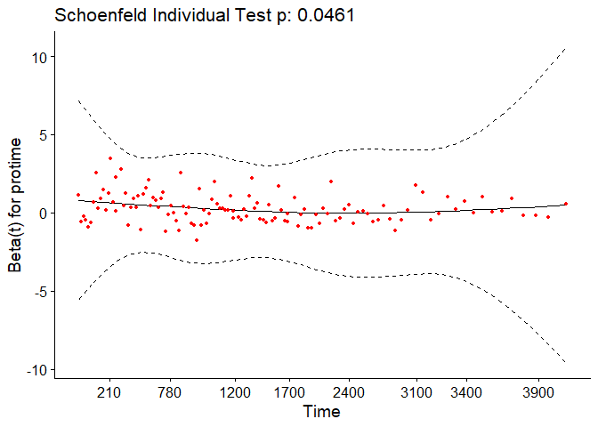
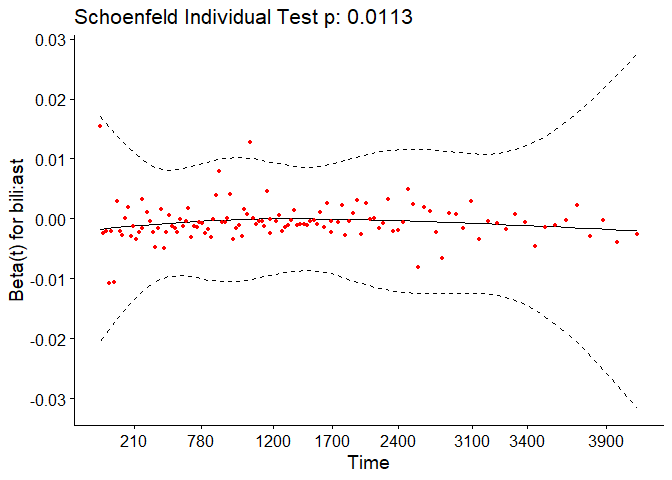

# Predicting Survival and Controlling for Bias with Random Survival Forests and Conditional Inference Forests

## What is Survival Analysis?

The main goal of survival analysis is to analyze and estimate the
expected amount of time until an event of interest occurs for a subject
or groups of subjects. Originally, survival analysis was developed for
the primary use of measuring the lifespans of certain populations.
However, over time its utilities have extended to a wide array of
applications even outside of the domain of healthcare. Thus, while
biological death continues to be the main outcome under the scrutiny of
survival analysis, other outcomes of interest may include time to
mechanical failure, time to repeat offense of a released inmate, time to
the split of a financial stock and more! Time in survival analysis is
relative and all subjects of interest are likened to a common starting
point at baseline (t = 0) with a 100% probability of not experiencing
the event of interest.

Subjects are observed from baseline to some often pre-specified time at
the end of study. Thus, not every subject will experience the event of
interest within the observational period’s time frame. In this case, we
don’t know if or when these subjects will experience the event, we just
know that they have not experienced it during the study period. This is
called **censoring**, more specifically, right-censoring. Right
censoring is just one of multiple forms of censoring that survival data
strives to adjust for and the form that we will focus on in this
comprehensive review. Dropout is also a form of right censoring. The
event of interest can happen during the specified time frame, outside of
the time frame, or not at all but we don’t know which scenario applies
to the individuals that leave the study early.

<figure>

<figcaption aria-hidden="true"><em>Right censoring occurs when a subject
enters the study before experiencing the event of interest at time = 0
and leaves the study without experiencing the event either by not
staying the full observational time, or staying the full time without
having the event occur.</em></figcaption>
</figure>

It’s imperative that we still consider these censored observations in
our study instead of removing them so that we don’t bias our results
towards only those individuals that experienced the event of interest
within the observational time frame. Thus, in survival analysis, not
only do we include time from baseline at event of interest, but we also
include a binary variable indicating whether an individual experienced
the event or was censored instead.

In standard survival analysis, the **survival function**, S(t) is what
defines the probability that the event of interest has **not** yet
happened at time = t.

S(t) is non-increasing and ranges between 0 and 1. The hazard function
on the other hand is defined as the instantaneous risk of an individual
experiencing the event of interest within a small time frame.

Both survival functions and hazard functions are alternatives to
probability density functions and are better suited for survival data.

Survival regression involves not only information about censorship and
time to event, but also additional predictor variables of interest like
the sex, age, race, etc. of an individual. Cox proportional hazards
models is a popular and widely utilized modeling technique for survival
data because it considers the effects of covariates on the outcome of
interest as well as examines the relationships between these variables
and the survival distribution. While this model is praised for its
flexibility and simplicity, it is also often criticized for its
restrictive proportional hazards assumption.

The proportional hazards assumption states that the relative hazard
remains constant over time across the different strata/covariate levels
in the data. The most popular graphical technique for evaluating the PH
assumption involves comparing estimated **log-log survival curves** over
different strata of the variables being investigated. A log-log survival
curve is a transformation of an estimated survival curve that results
from taking the natural log of an estimated survival probability twice.
Generally, if the log-log survival curves are approximately parallel for
each level of the covariates then the proportional hazard assumption is
met.

In the case of continuous covariates, this assumption can also be
checked using statistical tests and graphical methods based on the
scaled Schoenfeld residuals. The Schoenfeld residuals are calculated for
all covariates for each individual experiencing an event at a given
time. Those are the *differences* between that individual’s covariate
values at the event time and the corresponding risk-weighted average of
covariate values among all individuals at risk. The Schoenfeld residuals
are then scaled inversely with respect to their covariances/variances.
We can think of this as down-weighting Schoenfeld residuals whose values
are uncertain because of high variance. If the assumption is valid, the
*Schoenfeld residuals* are independent of time. A plot that shows a
non-random pattern against time is evidence of violation of the PH
assumption. In summary, the proportional hazard assumption is supported
by a non-significant relationship between residuals and time, and
refuted by a significant relationship.

## Review of Random Forests

## Random Survival Forests

## Conditional Inference Forests

## Applications

### PBC Data

Primary sclerosing cholangitis is an autoimmune disease leading to
destruction of the small bile ducts in the liver. Progression is slow
but inexorable, eventually leading to cirrhosis and liver
decompensation.

This data is from the Mayo Clinic trial in PBC conducted between 1974
and 1984. A total of 424 PBC patients met eligibility criteria for the
randomized placebo controlled trial of the drug D-penicillamine. This
dataset tracks survival status until end up follow up period as well as
contains many covariates collected during the clinical trial.

<table>
<colgroup>
<col style="width: 27%" />
<col style="width: 72%" />
</colgroup>
<thead>
<tr class="header">
<th>Variable</th>
<th>Description</th>
</tr>
</thead>
<tbody>
<tr class="odd">
<td>id</td>
<td>case number</td>
</tr>
<tr class="even">
<td>time</td>
<td>number of days between registration and the earlier of death</td>
</tr>
<tr class="odd">
<td>status</td>
<td>status at endpoint, 0/1/2 for censored, transplant, dead</td>
</tr>
<tr class="even">
<td>trt</td>
<td>1/2/NA for D-penicillmain, placebo, not randomised</td>
</tr>
<tr class="odd">
<td>age</td>
<td>in years</td>
</tr>
<tr class="even">
<td>sex</td>
<td>m/f</td>
</tr>
<tr class="odd">
<td>ascites</td>
<td>presence of ascites</td>
</tr>
<tr class="even">
<td>hepato</td>
<td>presence of hepatomegaly or enlarged liver</td>
</tr>
<tr class="odd">
<td>spiders</td>
<td>blood vessel malformations in the skin</td>
</tr>
<tr class="even">
<td>edema</td>
<td>0 no edema, 0.5 untreated or successfully treated 1 edema despite
diuretic therapy</td>
</tr>
<tr class="odd">
<td>bili</td>
<td>serum bilirunbin (mg/dl)</td>
</tr>
<tr class="even">
<td>chol</td>
<td>serum cholesterol (mg/dl)</td>
</tr>
<tr class="odd">
<td>albumin</td>
<td>serum albumin (g/dl)</td>
</tr>
<tr class="even">
<td>copper</td>
<td>urine copper (ug/day)</td>
</tr>
<tr class="odd">
<td>alk.phos</td>
<td>alkaline phosphotase (U/liter)</td>
</tr>
<tr class="even">
<td>ast</td>
<td>aspartate aminotransferase, once called SGOT (U/ml)</td>
</tr>
<tr class="odd">
<td>trig</td>
<td>triglycerides (mg/dl)</td>
</tr>
<tr class="even">
<td>platelet</td>
<td>platelet count</td>
</tr>
<tr class="odd">
<td>protime</td>
<td>standardised blood clotting time</td>
</tr>
<tr class="even">
<td>stage</td>
<td>histologic stage of disease (needs biopsy)</td>
</tr>
</tbody>
</table>

**Variable Selection**

In order to choose the variables that we want to use in our models, we
will first run a cox proportional

    # test two-way interactions
    pbc.full <- coxph(Surv(time, status) ~ (.)^2, data =  pbc_use)
    step(pbc.full, direction = "backward")

    pbc_cox <- coxph(Surv(time, status) ~ age + edema + bili + albumin + 
      copper + ast + protime + stage + age:edema + age:copper + 
      bili:ast, 
      data = pbc_use)

We can test the proportional-hazards assumption using the `cox.zph`
function.

For each covariate, the function correlates the corresponding set of
scaled Schoenfeld residuals with time to test for independence between
residuals and time. Additionally, it performs a global test for the
model as a whole.

    test.ph <- cox.zph(pbc_cox)
    test.ph

    ##              chisq df     p
    ## age         0.3869  1 0.534
    ## edema       1.8393  1 0.175
    ## bili        4.6535  1 0.031
    ## albumin     0.1930  1 0.660
    ## copper      0.0297  1 0.863
    ## ast         0.5231  1 0.470
    ## protime     3.9768  1 0.046
    ## stage       2.8331  1 0.092
    ## age:edema   3.2337  1 0.072
    ## age:copper  0.0880  1 0.767
    ## bili:ast    6.4185  1 0.011
    ## GLOBAL     20.1396 11 0.043

    ## $`3`

    ## $`7`

    ## $`11`

The output from the test tells us that the test is statistically
significant for bili, protime, and the interaction between bili and ast
at a significance level of 0.05. It’s also globablly statistically
significant with a p-value of 0.04. Thus, the PH assumption is violated.

**Random Forest Implementation**

**Conditional Inference Forest Implementation**

### Employee Turnover Data

A dataset found on Kaggle containing the employee attrition information
of 1,129 employees and information about time to turnover, their gender,
age, industry, profession, employee pipeline information, the presence
of a coach on probation, the gender of their supervisor, and wage
information.

<table>
<colgroup>
<col style="width: 26%" />
<col style="width: 73%" />
</colgroup>
<thead>
<tr class="header">
<th>Variable</th>
<th>Description</th>
</tr>
</thead>
<tbody>
<tr class="odd">
<td>stag</td>
<td>Experience (time)</td>
</tr>
<tr class="even">
<td>event</td>
<td>Employee turnover</td>
</tr>
<tr class="odd">
<td>gender</td>
<td>Employee’s gender, female (f), or male (m)</td>
</tr>
<tr class="even">
<td>age</td>
<td>Employee’s age (year)</td>
</tr>
<tr class="odd">
<td>industry</td>
<td>Employee’s Industry</td>
</tr>
<tr class="even">
<td>profession</td>
<td>Employee’s profession</td>
</tr>
<tr class="odd">
<td>traffic</td>
<td>From what pipeline employee came to the company. 1. contacted the
company directly (advert). 2. contacted the company directly on the
recommendation of a friend that’s not an employee of the company
(recNErab). 3. contacted the company directly on the recommendation of a
friend that IS an employee of the company (referal). 4. applied for a
vacany on the job site (youjs) 5. recruiting agency brought you to the
employer (KA) 6. invited by an employer known before employment
(friends). 7. employer contacted on the recommendation of a person who
knows the employee (rabrecNErab). 8. employer reached you through your
resume on the job site (empjs).</td>
</tr>
<tr class="even">
<td>coach</td>
<td>presence of a coach (training) on probation</td>
</tr>
<tr class="odd">
<td>head_gender</td>
<td>head (supervisor) gender (m/f)</td>
</tr>
<tr class="even">
<td>greywage</td>
<td>The salary does not seem to the tax authorities. Greywage in Russia
or Ukraine means that the employer (company) pay just a tiny bit amount
of salary above the white-wage (white-wage means minimum wage)
(white/gray)</td>
</tr>
<tr class="odd">
<td>way</td>
<td>Employee’s way of transportation (bus/car/foot)</td>
</tr>
<tr class="even">
<td>extraversion</td>
<td>Extraversion score</td>
</tr>
<tr class="odd">
<td>independ</td>
<td>Independend score</td>
</tr>
<tr class="even">
<td>selfcontrol</td>
<td>Self-control score</td>
</tr>
<tr class="odd">
<td>anxiety</td>
<td>Anxiety Score</td>
</tr>
<tr class="even">
<td>novator</td>
<td>Novator Score</td>
</tr>
</tbody>
</table>

**Random Forest Implementation**

**Conditional Inference Forest Implementation**


