# Predicting Survival and Controlling for Bias with Random Survival Forests and Conditional Inference Forests

## What is Survival Analysis?

The main goal of survival analysis is to analyze and estimate the
expected amount of time until an event of interest occurs for a subject
or groups of subjects. Originally, survival analysis was developed for
the primary use of measuring the lifespans of certain populations[1].
However, over time its utilities have extended to a wide array of
applications even outside of the domain of healthcare. Thus, while
biological death continues to be the main outcome under the scrutiny of
survival analysis, other outcomes of interest may include time to
mechanical failure, time to repeat offense of a released inmate, time to
the split of a financial stock and more! Time in survival analysis is
relative and all subjects of interest are likened to a common starting
point at baseline (t = 0) with a 100% probability of not experiencing
the event of interest[2].

Subjects are observed from baseline to some often pre-specified time at
the end of study. Thus, not every subject will experience the event of
interest within the observational period’s time frame. In this case, we
don’t know if or when these subjects will experience the event, we just
know that they have not experienced it during the study period. This is
called **censoring**, more specifically, right-censoring[3]. Right
censoring is just one of multiple forms of censoring that survival data
strives to adjust for and the form that we will focus on in this
comprehensive review. Dropout is also a form of right censoring. The
event of interest can happen during the specified time frame, outside of
the time frame, or not at all but we don’t know which scenario applies
to the individuals that leave the study early.

<figure>

<figcaption aria-hidden="true"><em>Right censoring occurs when a subject
enters the study before experiencing the event of interest at time = 0
and leaves the study without experiencing the event either by not
staying the full observational time, or staying the full time without
having the event occur.</em></figcaption>
</figure>

It’s imperative that we still consider these censored observations in
our study instead of removing them so that we don’t bias our results
towards only those individuals that experienced the event of interest
within the observational time frame. Thus, in survival analysis, not
only do we include time from baseline at event of interest, but we also
include a binary variable indicating whether an individual experienced
the event or was censored instead.

In standard survival analysis, the **survival function**, S(t) is what
defines the probability that the event of interest has **not** yet
happened at time = t.[4]

S(t) is non-increasing and ranges between 0 and 1. The **hazard
function** on the other hand is defined as the instantaneous risk of an
individual experiencing the event of interest within a small time
frame[5].

Both survival functions and hazard functions are alternatives to
probability density functions and are better suited for survival data.

Survival regression involves not only information about censorship and
time to event, but also additional predictor variables of interest like
the sex, age, race, etc. of an individual. The Cox proportional hazards
model is a popular and widely utilized modeling technique for survival
data because it considers the effects of covariates on the outcome of
interest as well as examines the relationships between these variables
and the survival distribution[6]. While this model is praised for its
flexibility and simplicity, it is also often criticized for its
restrictive proportional hazards assumption.

**The Proportional Hazards Assumption**

The **proportional hazards assumption** states that the relative hazard
remains constant over time across the different strata/covariate levels
in the data[7]. The most popular graphical technique for evaluating the
PH assumption involves comparing estimated **log-log survival curves**
over different strata of the variables being investigated[8]. A log-log
survival curve is a transformation of an estimated survival curve that
results from taking the natural log of an estimated survival probability
twice. Generally, if the log-log survival curves are approximately
parallel for each level of the covariates then the proportional hazard
assumption is met.

<figure>

<figcaption aria-hidden="true"><em>The proportional hazards assumption
states that the survival curves for different strata in the data are
proportional over time and can be assessed by gauging the parallel
nature of log-log survival curves.</em></figcaption>
</figure>

In the case of continuous covariates, this assumption can also be
checked using statistical tests and graphical methods based on the
scaled **Schoenfeld residuals**[9]. The Schoenfeld residuals are
calculated for all covariates for each individual experiencing an event
at a given time. Those are the *differences* between that individual’s
covariate values at the event time and the corresponding risk-weighted
average of covariate values among all individuals at risk. The
Schoenfeld residuals are then scaled inversely with respect to their
covariances/variances. We can think of this as down-weighting Schoenfeld
residuals whose values are uncertain because of high variance. If the
assumption is valid, the Schoenfeld residuals are independent of time. A
plot that shows a non-random pattern against time is evidence of
violation of the PH assumption. In summary, the proportional hazard
assumption is supported by a non-significant relationship between
residuals and time, and refuted by a significant relationship.

This is a strong assumption and is often viewed as impractical as it is
more often than not violated. There are a number of extensions that aim
to deal with data that violate this assumption, but they often rely on
restrictive functions or limit the ability to estimate the effects of
covariates on survival. **Random survival forests** provide an
attractive non-parameteric alternative to these models[10].

## Review of Random Forests

## Random Survival Forests

Used to analyze time to event survival data.

Used to analyze time to event survival data.

Random survival forests use splitting criterion based on survival time
and censoring status. Survival trees are binary trees which recursively
split tree nodes so that the dissimilarity between child nodes is
maximized. Eventually the dissimilar cases are separated and each node
becomes more homogenous. The predictive outcome is defined as the total
number of deaths, which is derived from the ensemble cumulative hazard
function (CHF).

The algorithm:

1.  Draw *B* bootstrap samples from the data

2.  Grow a survival tree for each bootstrap sample. For each node of the
    tree, consider *p* random variables to split on. The node is split
    with the candidate variable which maximizes the survival difference
    between child nodes.

3.  Grow the tree as long to full size and stop when the terminal node
    has no less than *d*0 &gt; 0 unique deaths.

4.  Average over *B* survival trees to obtain the ensemble CHF.

5.  Calculate the prediction error for the ensemble CHF using OOB error.

We determine a terminal node *h* ∈ *T* when there are no less than
*d*0 &gt; 0 unique deaths. Let us define
*d**l*, *h* and *Y**l*, *h* as the number of
deaths and individuals who are at risk at time *t**l*, *h*.
Then the CHF estimate for a terminal node *h* is defined as

Each individual *i* has a *d* dimensional covariate **x***i*.
The binary structure of survival trees allows **x***i* to be
classified into a unique terminal node *h*. Thus the CHF for individual
*i* is

The ensemble CHF is found by averaging over

survival trees.

## Conditional Inference Forests

While random survival forests tend to be biased toward variables with many split points, conditional inference forests are designed to reduce this selection bias. Conditional inference forests are designed by separating the algorithm which selects the best splitting covariate from the algorithm which selects the best split point.

The algorithm:

1.  For case weights *w*, set the global null hypothesis of independence between any of the *p* covariates and the response variable. Stop the algorithm if we fail to reject the null hypothesis. Otherwise, select the *j*th covariate *X*j* with the strongest association to *T*.

2.  Select a set *A* in *X*j in order to split *X*j into two disjoint sets: *A** and *X*j without *A*. The weights *w*a and *w*b determine the two subgroups with

3. Repeat steps 1 and 2 recursively using modified caseweights *w*a and *w*b

## Applications

We will run a random survival forest model and a conditional inference
forest model on two real survival datasets.

1.  <u>PBC Data</u>

The first dataset, the PBC dataset hails from the `survival` package in
R and summarizes the survival data of primary biliary cirrhosis (PBC)
patients from a randomized trial conducted between 1974 and 1984[11].

Most of the covariates in the PBC data are either continuous or have two
levels (few split-points).

1.  <u>Employee Data</u>

The second dataset was found on Kaggle, an online community platform for
data scientists and machine learning enthusiasts allowing for the
public-use of a vast array of practical datasets. This dataset contains
the employee attrition information of 1,129 employees.

Unlike the PBC dataset, this data consists of many categorical variables
with most of them having more than two-levels (many split-points).

**Model Tuning**

In the case of the random survival forest model, we will tune for two
parameter values, number of variables to possibly split at each node
(mtry) and minimum size of terminal node (nodesize). We will choose the
combination on each data set that yields the lowest out-of-bag error.

**Evaluating the Models: Variable Importance**

For each model, we will assess the ranked **variable importance**. We’ll
do this using the `varImp` function from the `caret` package in R[12].
This function tracks the changes in metric statistics for each predictor
and accumulates the reduction in the statistic when each predictor’s
feature is added to the model. The reduction is the measure of variable
importance. For trees/forests, the prediction accuracy on the out of bag
sample is recorded. The same is done after permuting each predictor
variable. The difference between the two accuracies are averaged over
all trees, and normalized by the standard error. We’ll aim to compare
how each of the two models rank the importance of the different
covariates.

**Evaluating the Models: Brier Scores**

In certain applications, it is of interest to compare the predictive
accuracy of different survival regression strategies for building a risk
prediction model. There are several metrics that can be used to assess
the resulting probabilistic risk predictions. We’re going to focus on
one of the most popular metrics, the **Brier score**[13]. The brier
score for an individual is defined as the squared difference between
observed survival status (1 = alive at time t and 0 = dead at time t)
and a model based prediction of surviving up to time t. The survival
status at time t will be right censored for some data. For time to event
outcome, this measure can be estimated point-wise over time. We will
concentrate on comparing the performance of our models using
**prediction error curves** that are obtained by combining
time-dependent estimates of the population average Brier score.

Using a test sample of size

, Brier scores at time t are defined as:

where

P(C &gt; t | X = x) is the Kaplan-Meier estimate of the conditional
survival function of the censoring times.

The integrated Brier scores are given by:

To avoid the problem of overfitting that arises from using the same data
to train and test the model, we used the Bootstrap cross-validated
estimates of the integrated Brier scores. The prediction errors are
evaluated in each bootstrap sample.

The prediction errors for each of our models will be implemented in the
`pec` package in R[14]. We implement bootstrap cross-validation to get
our estimates for the integrated brier scores. The models are assessed
on the data samples that are NOT in the bootstrap sample (OOB data).

### PBC Data

The following description comes from the `survival` package in R[15]:

Primary sclerosing cholangitis is an autoimmune disease leading to
destruction of the small bile ducts in the liver. Progression is slow
but inexorable, eventually leading to cirrhosis and liver
decompensation.

This data is from the Mayo Clinic trial in PBC conducted between 1974
and 1984. A total of 424 PBC patients met eligibility criteria for the
randomized placebo controlled trial of the drug D-penicillamine. This
dataset tracks survival status until end up follow up period as well as
contains many covariates collected during the clinical trial.

<table>
<colgroup>
<col style="width: 36%" />
<col style="width: 63%" />
</colgroup>
<thead>
<tr class="header">
<th>Variable</th>
<th>Description</th>
</tr>
</thead>
<tbody>
<tr class="odd">
<td>id</td>
<td>case number</td>
</tr>
<tr class="even">
<td>time</td>
<td>number of days between registration and the earlier of death,
transplant, or end of observational period</td>
</tr>
<tr class="odd">
<td>status</td>
<td>status at endpoint, 0/1/2 for censored, transplant, dead</td>
</tr>
<tr class="even">
<td>trt</td>
<td>1/2/NA for D-penicillmain, placebo, not randomized</td>
</tr>
<tr class="odd">
<td>age</td>
<td>in years</td>
</tr>
<tr class="even">
<td>sex</td>
<td>m/f</td>
</tr>
<tr class="odd">
<td>ascites</td>
<td>presence of ascites</td>
</tr>
<tr class="even">
<td>hepato</td>
<td>presence of hepatomegaly or enlarged liver</td>
</tr>
<tr class="odd">
<td>spiders</td>
<td>blood vessel malformations in the skin</td>
</tr>
<tr class="even">
<td>edema</td>
<td>0 no edema, 0.5 untreated or successfully treated 1 edema despite
diuretic therapy</td>
</tr>
<tr class="odd">
<td>bili</td>
<td>serum bilirunbin (mg/dl)</td>
</tr>
<tr class="even">
<td>chol</td>
<td>serum cholesterol (mg/dl)</td>
</tr>
<tr class="odd">
<td>albumin</td>
<td>serum albumin (g/dl)</td>
</tr>
<tr class="even">
<td>copper</td>
<td>urine copper (ug/day)</td>
</tr>
<tr class="odd">
<td>alk.phos</td>
<td>alkaline phosphotase (U/liter)</td>
</tr>
<tr class="even">
<td>ast</td>
<td>aspartate aminotransferase, once called SGOT (U/ml)</td>
</tr>
<tr class="odd">
<td>trig</td>
<td>triglycerides (mg/dl)</td>
</tr>
<tr class="even">
<td>platelet</td>
<td>platelet count</td>
</tr>
<tr class="odd">
<td>protime</td>
<td>standardized blood clotting time</td>
</tr>
<tr class="even">
<td>stage</td>
<td>histologic stage of disease (needs biopsy)</td>
</tr>
</tbody>
</table>

**Variable Selection**

In order to choose the variables that we want to use in our models, we
will first run a cox proportional hazards model with all of the possible
main effects in our data. We will then go through a backwards
elimination process, removing the variables with the highest p-values
over a significance level of 0.05 one by one until all of the main
effects are statistically significant. Then, we’ll test for all two-way
interaction terms and perform backwards elimination until all
two-interactions left in the model are statistically significant.

Note that the status variable will be simplified to two levels.
Individuals will have a value of 1 if they experienced death, and 0
otherwise, making **death our event of interest**.

    # test main effects
    pbc.main <- coxph(Surv(time, status) ~ ., data =  pbc_use)
    step(pbc.main, direction = "backward")

    # test two-way interactions
    pbc.full <- coxph(Surv(time, status) ~ (.)^2, data =  pbc_use)
    #step(pbc.full, direction = "backward")

Going through backwards elimination leaves us with a model with age,
edema status (edema), serum bilirunbin (bili), serum albumin (albumin),
urine copper (copper), aspartate aminotransferase (ast), standardised
blood clotting time (protime), histologic stage of disease (stage) and
the interactions between age and edema status, age and urine copper, and
serum bilirunbin and aspartate aminotransferase.

Note that due to the nature of this dataset, some of the subgroups have
not yet reached 50% survival as far as the scope of the information that
we have goes. Thus, some survival times were not able to be implemented
by our methods due to ‘missingness’. To make up for this shortage, we
utilized an oversampling technique to bootstrap sample for more
observations which also ended up sampling for more censored observations
in our data.

    pbc_cox <- coxph(Surv(time, status) ~ age + edema + bili + albumin + 
      copper + ast + protime + stage + age:edema + age:copper + 
      bili:ast, 
      data = pbc_use)

We can test the proportional-hazards assumption using the `cox.zph`
function.

For each covariate, the function correlates the corresponding set of
scaled Schoenfeld residuals with time to test for independence between
residuals and time. Additionally, it performs a global test for the
model as a whole.

    test.ph <- cox.zph(pbc_cox)
    test.ph

    ##             chisq df       p
    ## age        10.884  1 0.00097
    ## edema       1.115  1 0.29091
    ## bili        6.809  1 0.00907
    ## albumin     3.630  1 0.05673
    ## copper      0.932  1 0.33430
    ## ast         0.716  1 0.39761
    ## protime    14.552  1 0.00014
    ## stage      17.315  1 3.2e-05
    ## age:edema   1.053  1 0.30492
    ## age:copper  0.292  1 0.58908
    ## bili:ast   11.955  1 0.00055
    ## GLOBAL     63.669 11 1.9e-09

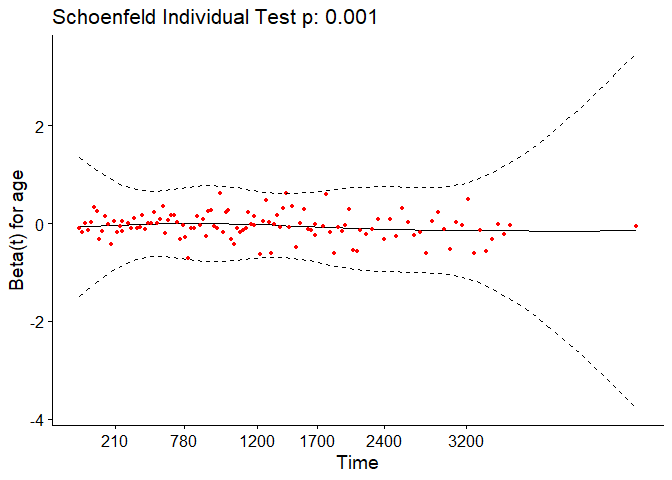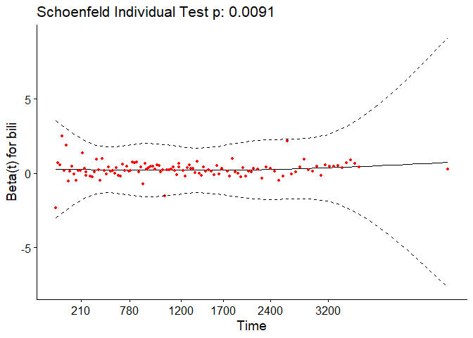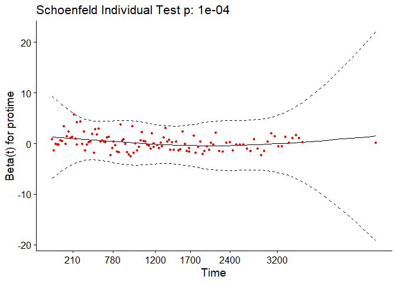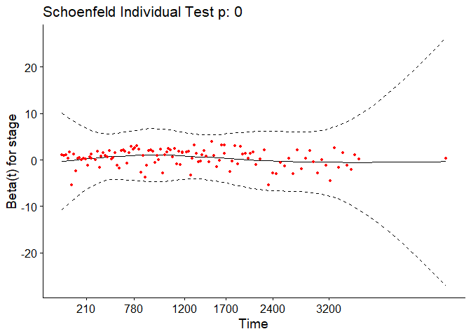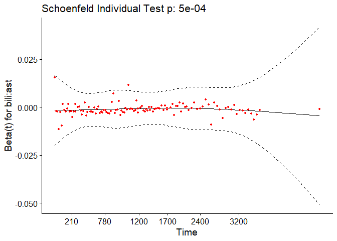

The output from the test tells us that the test is statistically
significant for age, bili, protime, stage, and the interaction between
bili and ast at a significance level of 0.05. It’s also globally
statistically significant with a p-value of 2e-09. Thus, the PH
assumption is violated.

Using random survival forests and conditional inference forests are
useful alternatives in this case.

**Random Survival Forest Implementation**

In hyperparameter tuning which was done using the `tune` function from
the `e1071` package in R, we found that an mtry value of 1 and a
nodesize of 5 produced the lowest out-of-bag error (0.107)[16].

    set.seed(1)
    # random forest
    pbc_rf <- rfsrc(Surv(time, status) ~ age + edema + bili + albumin + 
      copper + ast + protime + stage + age:edema + age:copper + 
      bili:ast, 
      mtry = 1,
      nodesize = 5,
      data = pbc_use)

**Conditional Inference Forest Implementation**

    set.seed(1)
    # run conditional inference forest

    pbc_cif <- pecCforest(Surv(time, status) ~ age + edema + bili + albumin + 
      copper + ast + protime + stage + age:edema + age:copper + 
      bili:ast,
      data = pbc_use)

**Comparing the Models**

We can plot the predicted survival curves for 4 random individuals in
our data (2 censored and 2 non-censored) and compare the predicted
median survival times (the time where the probability of survival = 0.5)
of both of the models to what is observed.

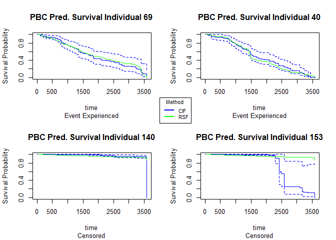

<table>
<thead>
<tr class="header">
<th>id</th>
<th>time</th>
<th>event</th>
<th>RSF median survival</th>
<th>CIF median survival</th>
</tr>
</thead>
<tbody>
<tr class="odd">
<td>69</td>
<td>3395</td>
<td>1</td>
<td>1827</td>
<td>1741</td>
</tr>
<tr class="even">
<td>40</td>
<td>1487</td>
<td>1</td>
<td>1487</td>
<td>1536</td>
</tr>
<tr class="odd">
<td>140</td>
<td>3445</td>
<td>0</td>
<td>3584</td>
<td>3584</td>
</tr>
<tr class="even">
<td>153</td>
<td>2224</td>
<td>0</td>
<td>3584</td>
<td>3584</td>
</tr>
</tbody>
</table>

For the observations that experienced death, the random forest model
predicts a median survival time closer to time of death than the random
survival forest model does. For the censored individuals \#140 and
\#153, both models predict the same median survival times for both
observations.

<u>Variable Importance</u>

We can compare the variable importance rankings between the random
survival forest and the conditional inference forest. Most notably, the
scale of variable importance is larger in the conditional inference
forest case than it is in the random survival forest. This is because
even though bili is the most important predictor in both models, it is
that much more important in the conditional inference forest.
Additionally, we see that while edema and copper are 2nd and 3rd most
important in the random survival forest, they are relatively not that
important in the conditional inference forest. Conversely, while age and
stage are important in the conditional inference forest, they are not as
important in the random survival forest. One thing to note is that the
variable edema can be viewed as a predictor with many split-points
(greater than 2), taking on three unique values: 0, 0.5, and 1. We may
be seeing the inherent bias problem coming into play here in the fact
that the random survival forest favors that variable in terms of its
importance.

<u>Prediction Error Curves</u>

We can compare the prediction error curves for the random survival
forest and the conditional inference forest models.

Using bootstrap cross-validation (
 =
50), we see an integrated brier score of 0.07 for the random survival
forest and 0.073 for the conditional inference forest. Recall that a
lower score means better performance. While the random survival forest
performs better here, we see that the difference is marginal and perhaps
negligible.

    ## 
    ## Integrated Brier score (crps):
    ## 
    ##         AppErr BootCvErr
    ## rsf      0.041     0.068
    ## cforest  0.054     0.073

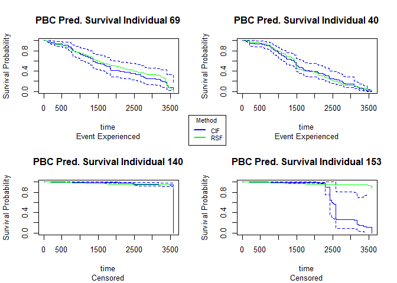

### Employee Turnover Data

A dataset found on Kaggle containing the employee attrition information
of 1,129 employees and information about time to turnover, their gender,
age, industry, profession, employee pipeline information, the presence
of a coach on probation, the gender of their supervisor, and wage
information.

<table>
<colgroup>
<col style="width: 36%" />
<col style="width: 63%" />
</colgroup>
<thead>
<tr class="header">
<th>Variable</th>
<th>Description</th>
</tr>
</thead>
<tbody>
<tr class="odd">
<td>stag</td>
<td>Experience (time)</td>
</tr>
<tr class="even">
<td>event</td>
<td>Employee turnover</td>
</tr>
<tr class="odd">
<td>gender</td>
<td>Employee’s gender, female (f), or male (m)</td>
</tr>
<tr class="even">
<td>age</td>
<td>Employee’s age (year)</td>
</tr>
<tr class="odd">
<td>industry</td>
<td>Employee’s Industry</td>
</tr>
<tr class="even">
<td>profession</td>
<td>Employee’s profession</td>
</tr>
<tr class="odd">
<td>traffic</td>
<td>From what pipeline employee came to the company. 1. contacted the
company directly (advert). 2. contacted the company directly on the
recommendation of a friend that’s not an employee of the company
(recNErab). 3. contacted the company directly on the recommendation of a
friend that IS an employee of the company (referal). 4. applied for a
vacany on the job site (youjs) 5. recruiting agency brought you to the
employer (KA) 6. invited by an employer known before employment
(friends). 7. employer contacted on the recommendation of a person who
knows the employee (rabrecNErab). 8. employer reached you through your
resume on the job site (empjs).</td>
</tr>
<tr class="even">
<td>coach</td>
<td>presence of a coach (training) on probation</td>
</tr>
<tr class="odd">
<td>head_gender</td>
<td>head (supervisor) gender (m/f)</td>
</tr>
<tr class="even">
<td>greywage</td>
<td>The salary does not seem to the tax authorities. Greywage in Russia
or Ukraine means that the employer (company) pay just a tiny bit amount
of salary above the white-wage (white-wage means minimum wage)
(white/gray)</td>
</tr>
<tr class="odd">
<td>way</td>
<td>Employee’s way of transportation (bus/car/foot)</td>
</tr>
<tr class="even">
<td>extraversion</td>
<td>Extraversion score</td>
</tr>
<tr class="odd">
<td>independ</td>
<td>Independend score</td>
</tr>
<tr class="even">
<td>selfcontrol</td>
<td>Self-control score</td>
</tr>
<tr class="odd">
<td>anxiety</td>
<td>Anxiety Score</td>
</tr>
<tr class="even">
<td>novator</td>
<td>Novator Score</td>
</tr>
</tbody>
</table>

**Variable Selection**

We’ll follow the same variable selection procedure that we did for the
PBC data.

    # test main effects
    turn.main <- coxph(Surv(stag, event) ~ ., data =  turn_use)
    step(turn.main, direction = "backward")

    # test two-way interactions
    turn.full <- coxph(Surv(stag, event) ~ (.)^2, data =  turn_use)
    step(turn.full, direction = "backward")

Going through backwards elimination leaves us with a model with age,
employee’s industry (industry), employee’s profession (profession),
employee’s pipeline origin (traffic), wage standard (greywage),
employee’s way of transportation (way), self-control score
(selfcontrol), anxiety score (anxiety), and the interactions between age
and way of transportation and way of transportation and self-control
score.

    turn_cox <- coxph(Surv(stag, event) ~ age + industry + profession + traffic + 
            greywage + way + selfcontrol + anxiety + age:way + way:selfcontrol,
           data =  turn_use)

We can test the proportional-hazards assumption for this model using the
`cox.zph` function.

    test.ph_turn <- cox.zph(turn_cox)
    test.ph_turn

    ##                   chisq df       p
    ## age              1.9060  1 0.16741
    ## industry        21.6544 15 0.11719
    ## profession      40.4758 14 0.00021
    ## traffic         11.9480  7 0.10228
    ## greywage         1.2658  1 0.26055
    ## way              1.0839  2 0.58160
    ## selfcontrol      0.0687  1 0.79319
    ## anxiety          1.0692  1 0.30112
    ## age:way          2.5780  2 0.27554
    ## way:selfcontrol  0.6640  2 0.71750
    ## GLOBAL          73.0448 46 0.00677

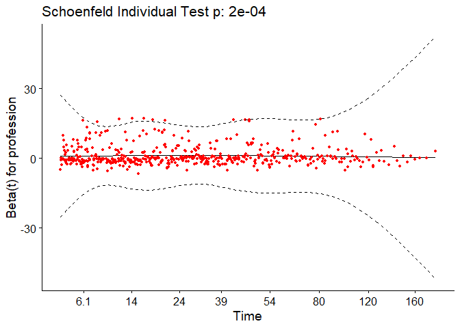

The output from the test tells us that the test is statistically
significant for profession at a significance level of 0.05. It’s also
globally statistically significant with a p-value of 0.007. Thus, the PH
assumption is violated and random survival forests and conditional
inference forests can be useful alternatives with this data as well.

**Random Survival Forest Implementation**

In hyperparameter tuning which was done by changing mtry values using the ranger function, we found that an mtry value of 2 produced the lowest out-of-bag error (0.313).

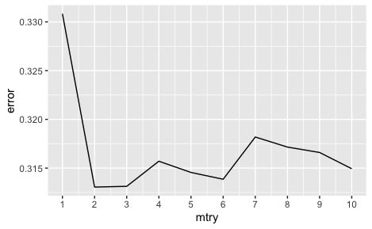

Note that to run random survival forest for the employee turnover data,
due to computational issues, we’ve switched to using the `ranger`
function from the `ranger` package in R. We’ll run a parameter tuned
random survival forest model with the variables and interactions that we
identified in variable selection.

    set.seed(1)
    # random survival forest
    turn_rsf <- ranger(Surv(stag, event) ~ age + industry + profession + traffic + 
            greywage + way + selfcontrol + anxiety +
              age.way + way.selfcontrol,
           data =  turn_use)

**Conditional Inference Forest Implementation**

We’ll run a conditional inference forest model next with the variables
and interactions that we identified in variable selection.

    set.seed(1)
    turn_cif <- pecCforest(Surv(stag, event) ~ age + industry + profession + traffic + 
            greywage + way + selfcontrol + anxiety +
              age.way + way.selfcontrol,
           data =  turn_use)

**Comparing the Models**

Similar to the PBC data, we will choose 4 random individuals in the
study, 2 who experienced the event of interest and 2 who are censored,
and plot and compare their predicted survival curves as well as their
predicted median survival times ( the time where the probability of
survival = 0.5) to what is observed.

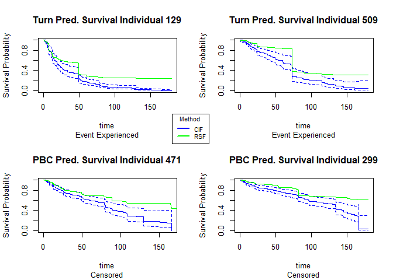

<table>
<thead>
<tr class="header">
<th>id</th>
<th>time</th>
<th>event</th>
<th>RSF median survival</th>
<th>CIF median survival</th>
</tr>
</thead>
<tbody>
<tr class="odd">
<td>129</td>
<td>49.38</td>
<td>1</td>
<td>49.3</td>
<td>21.6</td>
</tr>
<tr class="even">
<td>509</td>
<td>73.3</td>
<td>1</td>
<td>74.1</td>
<td>73.3</td>
</tr>
<tr class="odd">
<td>471</td>
<td>14.49</td>
<td>0</td>
<td>164.6</td>
<td>80.2</td>
</tr>
<tr class="even">
<td>299</td>
<td>73.43</td>
<td>0</td>
<td>179.4</td>
<td>133.0</td>
</tr>
</tbody>
</table>

We see that….

<u>Variable Importance</u>

First, we’ll compare the variables that the random survival forest model
and the conditional inference model found to be most important in the
training process on the employee turnover data.

<u>Prediction Error Curves</u>

We can compare the prediction error curves of the two models. Recall
that these estimates are based on the average brier scores computed at
different time points. We reduce
 = 5
for computation and run-time purposes.

    ## 
    ## Integrated Brier score (crps):
    ## 
    ##         AppErr BootCvErr
    ## rsfc     0.079     0.155
    ## cforest  0.061     0.120

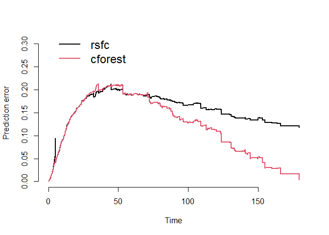

## Closing Thoughts



[1] Goel, M. K., Khanna, P., & Kishore, J. (2010). Understanding
survival analysis: Kaplan-Meier estimate. *International journal of
Ayurveda research*, *1*(4), 274.

[2] Goel, M. K., Khanna, P., & Kishore, J. (2010). Understanding
survival analysis: Kaplan-Meier estimate. *International journal of
Ayurveda research*, *1*(4), 274.

[3] Prinja, S., Gupta, N., & Verma, R. (2010). Censoring in clinical
trials: review of survival analysis techniques. *Indian journal of
community medicine: official publication of Indian Association of
Preventive & Social Medicine*, *35*(2), 217.

[4] Kleinbaum, D. G., & Klein, M. (2012). *Survival analysis: a
self-learning text* (Vol. 3). New York: Springer.

[5] Kleinbaum, D. G., & Klein, M. (2012). *Survival analysis: a
self-learning text* (Vol. 3). New York: Springer.

[6] Kleinbaum, D. G., & Klein, M. (2012). The Cox proportional hazards
model and its characteristics. In *Survival analysis* (pp. 97-159).
Springer, New York, NY.

[7] Kleinbaum, D. G., & Klein, M. (2012). The Cox proportional hazards
model and its characteristics. In *Survival analysis* (pp. 97-159).
Springer, New York, NY.

[8] Sestelo, M. (2017). A short course on Survival Analysis applied to
the Financial Industry.

[9] Hess, K. R. (1995). Graphical methods for assessing violations of
the proportional hazards assumption in Cox regression. *Statistics in
medicine*, *14*(15), 1707-1723.

[10] Nasejje, J. B., Mwambi, H., Dheda, K., & Lesosky, M. (2017). A
comparison of the conditional inference survival forest model to random
survival forests based on a simulation study as well as on two
applications with time-to-event data. *BMC medical research
methodology*, *17*(1), 1-17.

[11] Therneau, T. M. (2020). *A Package for Survival Analysis in R*.
<https://CRAN.R-project.org/package=survival>

[12] Kuhn, M. (2008). Building Predictive Models in R Using the caret
Package. Journal of Statistical Software, 28(5), 1 - 26.
doi:<http://dx.doi.org/10.18637/jss.v028.i05>

[13] Nasejje, J. B., Mwambi, H., Dheda, K., & Lesosky, M. (2017). A
comparison of the conditional inference survival forest model to random
survival forests based on a simulation study as well as on two
applications with time-to-event data. *BMC medical research
methodology*, *17*(1), 1-17.

[14] Mogensen UB, Ishwaran H, Gerds TA (2012). “Evaluating Random
Forests for Survival Analysis Using Prediction Error Curves.” *Journal
of Statistical Software*, **50**(11), 1–23.
<https://www.jstatsoft.org/v50/i11>.

[15] Therneau, T. M. (2020). *A Package for Survival Analysis in R*.
<https://CRAN.R-project.org/package=survival>

[16] Meyer D, Dimitriadou E, Hornik K, Weingessel A, Leisch F

(2021). \_e1071: Misc Functions of the Department of

Statistics, Probability Theory Group (Formerly: E1071), TU

Wien\_. R package version 1.7-9,

<https://CRAN.R-project.org/package=e1071>.
